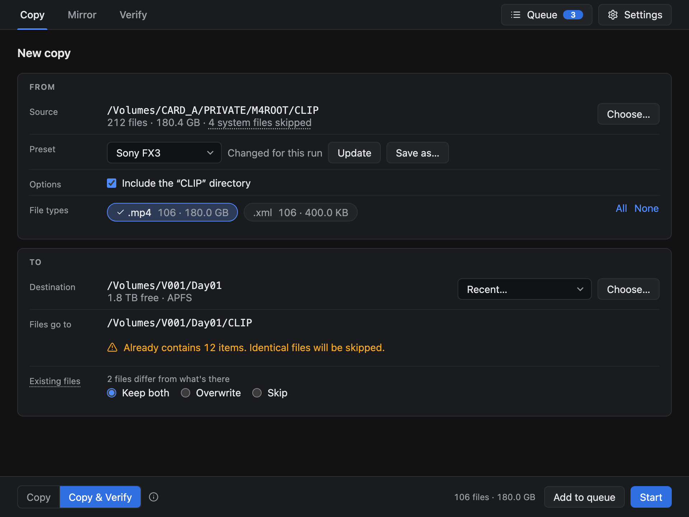
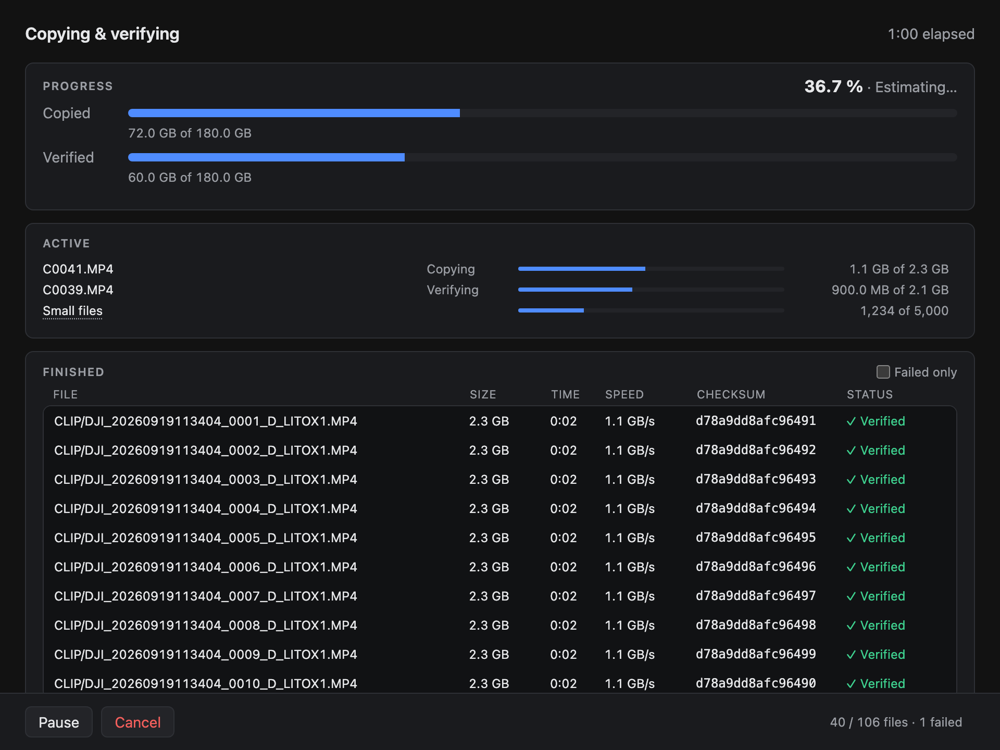
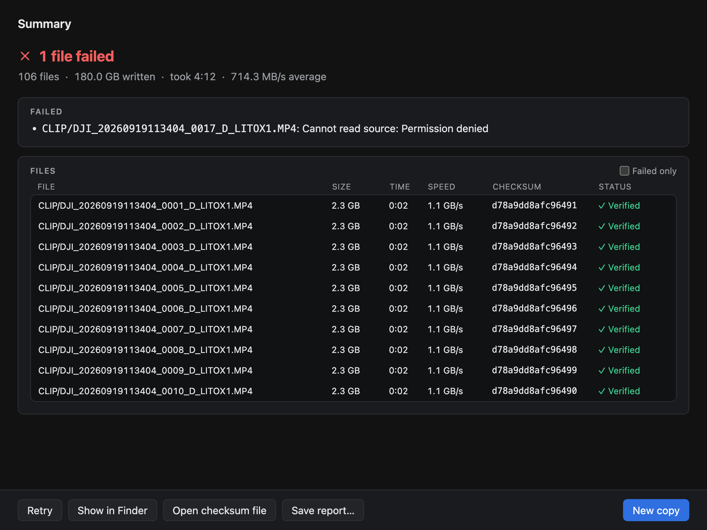
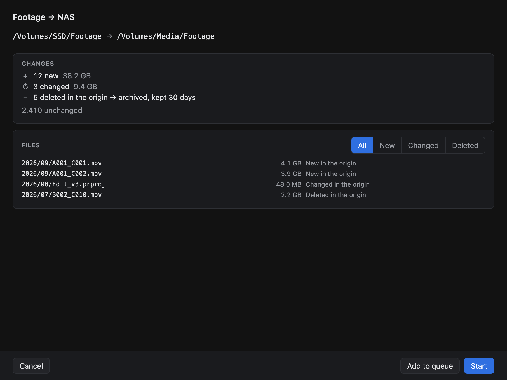
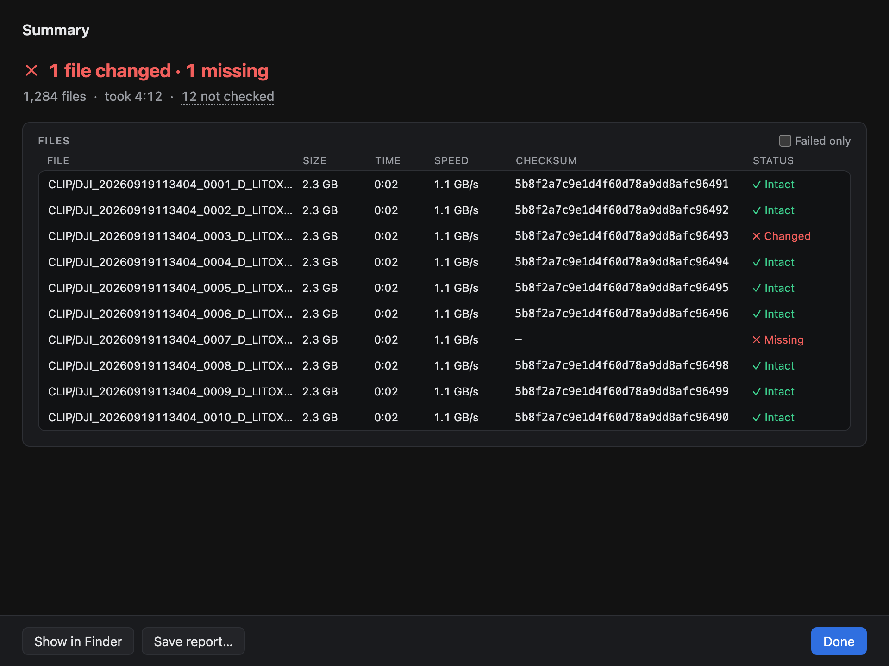
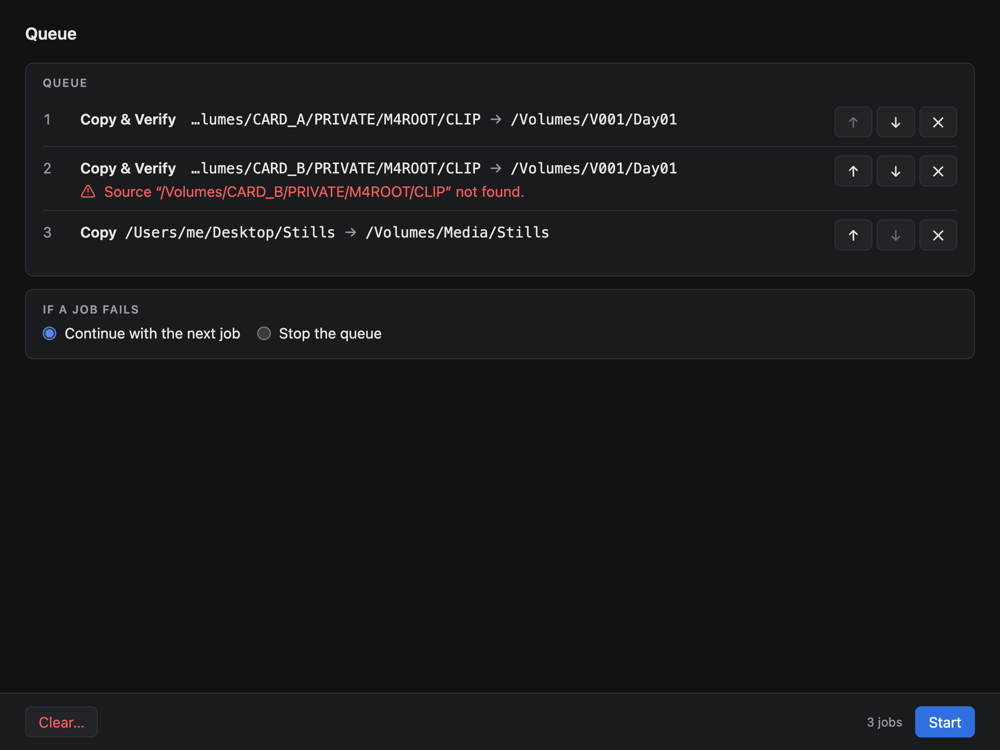
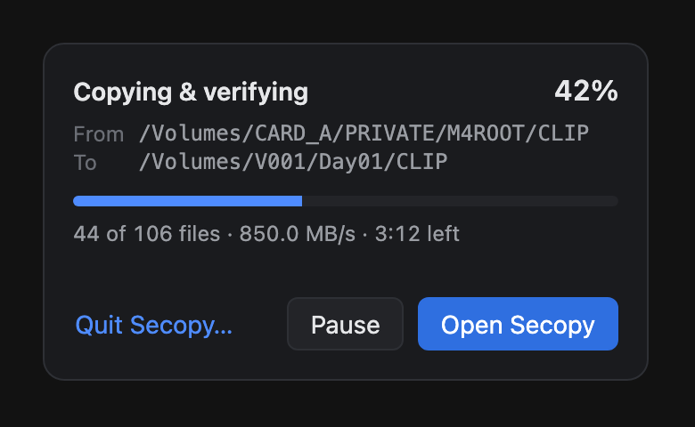
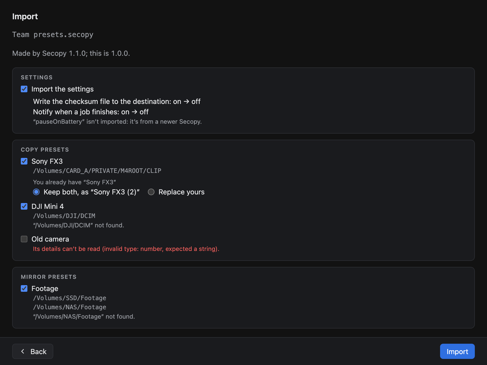

# Secopy user guide

Secopy copies files and proves it did. This guide walks through every screen. For installing,
see the [README](../README.md#install).

The window has three tabs, **Copy**, **Mirror** and **Verify**, plus **Queue** and
**Settings** on the right.

## Copy

### From: the source

Drop a directory or files on **From**, or press **Choose…** (⌘O).

- **A directory** is copied with everything inside it, keeping its structure and file dates.
  **Include the "…" directory** copies the directory itself (the files land in
  `destination/CLIP/…`); turn it off to copy only what's inside it.
- **Files** picked one by one are copied side by side into the destination.
- **Hidden files are copied** (cameras hide some of their own). Files computers leave behind,
  like `.DS_Store`, `._*` or `Thumbs.db`, are never copied; their count is shown, so nothing
  disappears without a word. Links are not followed.
- **File types** lists every extension with its count and size, largest first. Click one to
  leave it out; **All** and **None** select every type or none.

### Copy presets

A preset is a saved source with its settings: whether the directory itself is copied, and
which file types. Choose one in **Preset** and its source is loaded (or Secopy says its drive
isn't connected). A change you make afterwards lasts for this copy only, unless you press
**Update** (save it into the preset) or **Save as…** (a new preset). **Manage presets…**
opens the list to create, edit, export or delete presets. When typing file types there, `*`
means every type. A preset never holds a destination: you choose it for each copy.

### To: the destination

Drop a directory on **To**, or press **Choose…** (⌘D); **Recent…** lists the last ones.
Before you can start, Secopy checks and shows:

- **Where the files go**, the free space, and the drive's format.
- **What stops the copy:** the destination isn't there or can't be written to, there isn't
  enough free space, or the destination is inside the source. Start stays off.
- **Files that will fail:** a name the destination drive doesn't allow (FAT32 and exFAT
  refuse `: * ? " < > |`, for example), a file too large for FAT32's 4 GB limit, or something
  in the way. You can start anyway; those files are listed as failed. Names are never changed.
- **Files already there.** Identical files (same size and date) are skipped and counted as
  "already at the destination, not checked". For files that **differ**, choose once:
  **Keep both** (the new copy is named `name (1).ext`), **Overwrite** (the old file is
  replaced only once the new one is complete and verified) or **Skip**.

### Copy or Copy & Verify

- **Copy & Verify** (recommended) reads every file back from the destination drive after
  writing it and compares its checksum with the source's. A copy that doesn't match is
  copied again once; if it still doesn't match, it fails and no file is left under its name.
- **Copy** doesn't read back, which is faster; the checksum file is still written from the
  source.

Press **Start** (⌘↩), or **Add to queue** to run it later.

## While it copies

The bars show what's been copied and verified, with the speed and the time left. **Active**
shows the files in progress (small files together), and the list below every file that's
finished, with its checksum and status; **Failed only** filters it.

- **Pause** (Space) stops reading and writing until **Resume**.
- **Cancel** (⌘.) asks first. Files already copied stay, and the file in progress is removed.
  Tick **Also remove the files already copied** to put the destination back as it was.
- **Close the window** and the copy goes on, with its progress in the menu bar (see
  [Menu bar](#menu-bar)). Quitting asks first.

## Summary

The headline says what happened, and never "All … copied" unless every file was. Below it:
the figures, every file that failed and why, and every file with its checksum and status
(Verified, Copied, Skipped, Failed, Cancelled).

- **Retry** sets up a new copy of just the failed files; press Start to run it.
- **Show in Finder** opens the destination; **Open checksum file** opens the proof.
- **Save report…** saves the report as text (and JSON next to it).
- **New copy** starts again, keeping the destination.

### The checksum file and the report

Each copy writes a checksum file in the destination directory, named
`secopy_2026-09-27_140302.xxh64`: one line per file, its xxHash64 and its path. It's a
standard format; in Terminal, `cd` to the destination and run `xxhsum -c secopy_…xxh64` to
check every file. A file that failed isn't listed.

The report lists the settings, times, counts and the result of every file, including the
skipped ones. Every report is kept in `~/Library/Application Support/com.latecommits.secopy/reports`;
a setting also saves it next to the checksum file.

## Mirror

A mirror keeps a backup identical to a directory, one way: the origin is never written to.

- **New mirror** asks for a **Name**, the **Origin** and the **Destination**, what happens to
  **files deleted in the origin** (**Archive them** for a number of days, 30 by default, or
  **Delete them**), and the **Comparison**: **Standard** (size and modification date) or **Paranoid**
  (byte-for-byte comparison of both copies; very slow: reads all data on both sides).
- **Preview…** works out what a run would do before anything is touched:

- **Start** runs exactly what the preview showed. New and changed files are copied and
  verified; a changed file is replaced only once its new copy is verified. Files deleted in
  the origin are archived into the destination's hidden `.secopy-archive` directory (or
  deleted) **only after every copy succeeded**: a failed or cancelled run removes nothing.
- **How long archived files are kept:** at the start of every run, Secopy removes archived
  files older than the preset's days, counted from when they were archived. Changing the days
  applies to everything already archived: make them shorter and the next run removes the files
  now past them (the editor says so); make them longer and what's still there is kept longer.
- **Switching from Archive to Delete** asks what to do with what's already archived: **Delete
  them now**, or **Keep them** for the preset's days (runs keep removing them when due). If
  the destination isn't connected, or a job is running, you can choose **Delete it at the next
  run** instead: the next run deletes the archive before copying anything. Files that can't be
  deleted are listed, and go when they're due. Changing the destination at the same time leaves
  the old destination's archive as it is: it's no longer this mirror's.
- If a run looks wrong (the origin is empty, can't be fully read, or more than half of the
  backup would be removed), Secopy asks first; in the queue, such a run doesn't start.
- The destination keeps a checksum file of its own, `.secopy-checksums.xxh64`, so the backup
  can be verified.
- **Archive** (under the editor): files, size and oldest run in the destination's
  `.secopy-archive`. **Show in Finder** opens it; **Delete archive…** deletes it, after asking.
  Not while a job runs.

## Verify

Verify reads a copy again and compares every file with its checksum files, to find silent
damage (a failing drive, a file changed by something else).

**Choose…** a directory (a copy, a backup, or a whole drive): Secopy finds every `.xxh64`
checksum file inside it and shows how many files they list. **Start** reads each one again
from the drive and marks it **Intact**, **Changed**, **Missing** or unreadable. Files no
checksum file lists are counted as not checked. Nothing is written to the drive and nothing
is repaired.

## Queue

**Add to queue** on Copy, Mirror or Verify saves the job as it's set up. On the Queue screen,
reorder jobs with the arrows, remove them, and choose what happens **if a job fails**:
continue with the next job or stop the queue. **Start** runs them one after another; each is
checked when its turn comes, and one that can't start fails with its reason. The Mac stays
awake for the whole run, and one notification says how it went.

At the end, every job has its result and its own summary. Jobs that completed leave the
queue; the others stay, with the reason they failed. The queue is kept when Secopy quits.

## Menu bar

Close the window while a job or the queue runs and it keeps going: Secopy leaves the Dock
and its icon in the menu bar shows the progress (`42%`, `2/3 · 42%`, `Paused`, then ✓ or ✗).
Click it for the details, **Pause**, and **Open Secopy**:

Turn this off in Settings to have closing the window ask to stop the job instead.

## Export and import

**File › Export…** (or Settings) saves the settings, the copy presets and the mirror presets,
as you choose, in a `.secopy` file: for a new Mac, or to share presets. A single preset can
be exported from its own screen. The queue and recent destinations are never exported.

**File › Import…** (or opening a `.secopy` file from Finder) shows what the file holds before
anything changes: settings that differ, each preset with its paths, paths not on this Mac,
and presets that can't be imported, with why. A preset whose name you already have is added
as **Keep both** ("Name (2)") unless you choose **Replace yours**. Nothing is imported while a
job runs.

## Settings

- **Write the checksum file to the destination** (on by default).
- **Show the count of skipped system files.**
- **Also save the job report next to the checksum file.**
- **Notify when a copy finishes**, when Secopy's window isn't in front.
- **Keep copying in the menu bar when the window is closed** (on by default).

Changes apply to the next job when you press **Save**; **Cancel** (or Esc) drops them.

## Keyboard

| Keys | Does |
|---|---|
| ⌘O / ⌘D | Choose the source / the destination |
| ⌘↩ | Start |
| ⌘. | Cancel the running job (asks first) |
| Space | Pause and resume |
| ⌘1 / ⌘2 / ⌘3 | Copy / Mirror / Verify |
| ⌘4 | Queue |
| ⌘, | Settings |
| Esc | Back from Settings, presets and Import; closes dialogs |

## When something goes wrong

- **A file failed.** The summary and the report say why for each file. Fix the cause (a
  name, a permission, a drive) and press **Retry**.
- **The drive was pulled out or filled up.** The job stops at once and says so. Files already
  copied are complete and listed; the file in progress is removed.
- **"The origin couldn't be read"** on a mirror: nothing is removed from the backup that run,
  so an unreadable file never looks deleted.
- **A copy looks damaged months later.** Run **Verify** on it: it names every file that
  changed or is missing.
